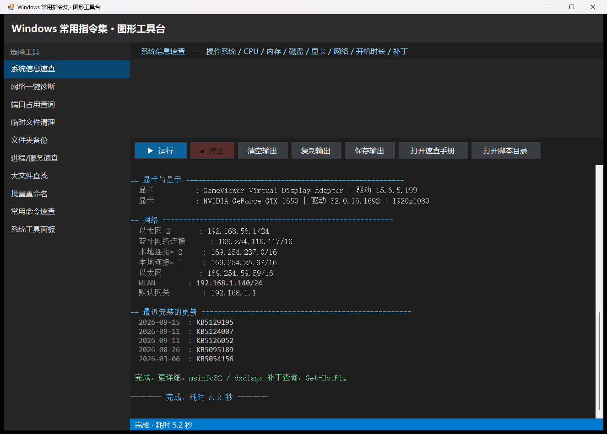

 Windows 常用指令集

[](https://github.com/112-a-eng/win-toolkit/actions/workflows/build-exe.yml)
[](LICENSE)
[](#)
[](#)

> 适用：Windows 10 / 11 / Server 2016+（Windows PowerShell 5.1 与 PowerShell 7 均可）
> 约定：`C:\>` 表示 CMD（命令提示符）；`PS>` 表示 PowerShell；未标注的表示两者通用。
> 配套脚本：见 `scripts\` 目录，双击 `scripts\run.bat` 或运行 `scripts\menu.ps1` 打开控制台菜单。



## 快速开始

| 方式 | 做法 | 适合 |
| --- | --- | --- |
| **图形版（推荐）** | 到 [Releases](https://github.com/112-a-eng/win-toolkit/releases/latest) 下载 `win-toolkit.exe`，双击即用 | 不想敲命令 |
| **winget 安装** | `winget install 112-a-eng.WinToolkit` | 喜欢包管理 |
| **源码运行** | `git clone` 后双击 `启动图形工具台.bat`，或运行 `scripts\run.bat` | 想改脚本 |

> winget 清单与提交说明见 `docs/winget.md`。

> EXE 只是「启动器 + 资源包」，脚本始终是磁盘上的明文 `.ps1`，随时可看可改：
> - 单独放在任何地方 → 自动解包到 `%LOCALAPPDATA%\WinCommandToolkit\app` 再启动
> - 和脚本放在同一目录 → 直接使用旁边那份脚本，改完重开就生效，不必重新打包

---

## 0. 怎么打开命令行

| 方式 | 操作 |
| --- | --- |
| 任意位置打开 CMD | `Win + R` → 输入 `cmd` → 回车 |
| 任意位置打开 PowerShell | `Win + R` → 输入 `powershell` → 回车 |
| 管理员权限 | `Win + X` → “终端(管理员)” / “Windows PowerShell(管理员)” |
| 在当前文件夹打开 | 资源管理器地址栏直接输入 `cmd` 或 `powershell` → 回车 |
| 在文件夹空白处右键 | Shift + 右键 → “在此处打开 PowerShell 窗口” |

```cmd
:: 提升为管理员（会弹 UAC）
C:\> powershell -Command "Start-Process cmd -Verb RunAs"
```
```powershell
PS> Start-Process pwsh -Verb RunAs          # 以管理员身份启动
PS> Start-Process notepad -Verb RunAs       # 以管理员身份启动任意程序
```

> 提示：不确定命令怎么用，先问内置帮助。
> ```cmd
> C:\> 命令 /?                  :: CMD 通用帮助
> C:\> robocopy /?              :: 几乎所有 exe 都支持 /?
> ```
> ```powershell
> PS> Get-Help Get-ChildItem -Full
> PS> Get-Help Copy-Item -Examples
> PS> Update-Help              :: 首次更新帮助文档（需管理员）
> ```

---

## 1. 任务反查表（想做什么 → 用什么命令）

| 我想…… | CMD | PowerShell |
| --- | --- | --- |
| 看当前目录有什么 | `dir` | `Get-ChildItem` / `ls` |
| 进目录 / 回上级 | `cd 路径` / `cd ..` | `Set-Location 路径` / `cd ..` |
| 找文件 | `dir /s /b 名字` | `Get-ChildItem -Recurse -Filter 名字` |
| 看文件内容 | `type 文件` | `Get-Content 文件` |
| 搜文件里的文字 | `findstr /s /i /n 关键词 *.*` | `Select-String -Path *.* -Pattern 关键词` |
| 复制/移动/删除 | `copy` `move` `del` | `Copy-Item` `Move-Item` `Remove-Item` |
| 整目录同步备份 | `robocopy 源 目标 /MIR` | `robocopy 源 目标 /MIR` |
| 看进程 / 杀进程 | `tasklist` / `taskkill` | `Get-Process` / `Stop-Process` |
| 看某端口被谁占用 | `netstat -ano \| findstr :8080` | `Get-NetTCPConnection -LocalPort 8080` |
| 测网络通不通 | `ping` `tracert` | `Test-Connection` `Test-NetConnection` |
| 看 IP / 刷 DNS | `ipconfig /all` / `ipconfig /flushdns` | `Get-NetIPConfiguration` / `Clear-DnsClientCache` |
| 查服务状态 | `sc query 服务名` | `Get-Service 服务名` |
| 启停服务 | `net start/stop 服务名` | `Start-Service` / `Stop-Service` |
| 查注册表 | `reg query` | `Get-ItemProperty` |
| 建计划任务 | `schtasks /create` | `New-ScheduledTask` |
| 装软件 | `winget install xxx` | `winget install xxx` |
| 算文件哈希 | `certutil -hashfile 文件 SHA256` | `Get-FileHash 文件` |
| 压缩/解压 zip | `tar -xf a.zip` | `Expand-Archive` / `Compress-Archive` |
| 查系统信息 | `systeminfo` | `Get-ComputerInfo` |
| 查开机多久了 | `systeminfo \| findstr /C:"启动时间"` | `(Get-CimInstance Win32_OperatingSystem).LastBootUpTime` |
| 修复系统文件 | `sfc /scannow` | `sfc /scannow` |
| 关机 / 重启 | `shutdown /s /t 60` | `Stop-Computer` |
| 查电池报告 | `powercfg /batteryreport` | `powercfg /batteryreport` |

---

## 2. 文件与目录

| CMD | 说明 |
| --- | --- |
| `dir /a /s /b` | 列出全部（含隐藏）、递归、仅路径 |
| `cd /d D:\proj` | 跨盘符切换目录（必须加 `/d`） |
| `md 新目录` / `rd /s /q 目录` | 新建 / 强制删除目录树 |
| `copy a.txt b.txt` | 复制文件 |
| `xcopy 源 目标 /E /I /H /Y` | 复制目录树（含空目录、隐藏、免确认） |
| `robocopy 源 目标 /MIR /Z /R:2 /W:2 /LOG:log.txt` | 镜像同步（备份首选，比 xcopy 强太多） |
| `move a.txt D:\bak\` | 移动/重命名 |
| `ren old.txt new.txt` | 重命名 |
| `del /f /q /s *.tmp` | 强制、静默、递归删除 |
| `type a.txt` | 查看内容 |
| `more a.txt` / `sort a.txt` | 分页 / 排序输出 |
| `tree /f` | 树形显示目录结构 |
| `attrib -h -r -s 文件` | 去掉隐含/只读/系统属性 |
| `mklink /D 链接名 目标目录` | 创建符号链接（需管理员或开发者模式） |
| `subst X: D:\data` | 把目录映射成盘符 |
| `where 命令名` | 查命令所在路径 |

| PowerShell | 说明 |
| --- | --- |
| `Get-ChildItem -Force -Recurse` | 全部文件含隐藏 |
| `New-Item -ItemType Directory 路径 -Force` | 建目录 |
| `Copy-Item 源 目标 -Recurse -Force` | 复制 |
| `Move-Item` / `Rename-Item` / `Remove-Item -Recurse -Force` | 移动/改名/删除 |
| `Get-Content a.txt -Tail 20 -Wait` | 看日志末尾并实时跟踪（≈ `tail -f`） |
| `Set-Content` / `Add-Content` / `Out-File -Append` | 写文件 / 追加 |
| `Select-String -Pattern "error" -Path *.log -Context 2` | 全文检索并显示上下文 |
| `Get-FileHash a.iso -Algorithm SHA256` | 哈希校验 |
| `(Get-ChildItem -Recurse \| Measure-Object Length -Sum).Sum/1GB` | 统计目录大小(GB) |

**常用组合**

```powershell
# 找出 D 盘 100MB 以上的大文件，按大小倒序
PS> Get-ChildItem D:\ -Recurse -File -ErrorAction SilentlyContinue |
      Where-Object Length -gt 100MB |
      Sort-Object Length -Descending |
      Select-Object -First 30 FullName, @{n='MB';e={[math]::Round($_.Length/1MB,1)}}

# 批量重命名：IMG_001.jpg → 照片_001.jpg
PS> Get-ChildItem *.jpg | Rename-Item -NewName { $_.Name -replace '^IMG_','照片_' }

# 按扩展名统计文件数量与占用
PS> Get-ChildItem -Recurse -File | Group-Object Extension |
      Select-Object Name, Count, @{n='MB';e={[math]::Round(($_.Group|Measure-Object Length -Sum).Sum/1MB,1)}} |
      Sort-Object MB -Descending
```

```cmd
:: CMD 下递归查找并复制所有 pdf 到 D:\pdfs
C:\> forfiles /s /m *.pdf /c "cmd /c copy @path D:\pdfs\"
```

---

## 3. 系统信息与硬件

| 命令 | 说明 |
| --- | --- |
| `systeminfo` | 系统/补丁/内存/网卡一览（较慢） |
| `ver` | 系统版本 |
| `hostname` | 计算机名 |
| `whoami` / `whoami /groups` / `whoami /priv` | 当前用户 / 所属组 / 权限 |
| `echo %USERNAME% %USERPROFILE% %COMPUTERNAME%` | 关键环境变量 |
| `wmic os get Caption,Version,OSArchitecture` | OS 信息（wmic 已弃用，仍可用） |
| `wmic cpu get name,numberofcores` | CPU 信息 |
| `driverquery /v /fo table` | 驱动列表 |
| `dxdiag` | 图形/声音详细信息（图形界面） |
| `msinfo32` | 系统信息（图形界面） |
| `powercfg /batteryreport /output "%USERPROFILE%\battery.html"` | 电池健康报告 |
| `powercfg /a` | 支持的睡眠状态 |
| `slmgr /xpr` | Windows 激活状态 |

```powershell
PS> Get-ComputerInfo | Select-Object CsName, WindowsProductName, OsHardwareAbstractionLayer, CsTotalPhysicalMemory
PS> Get-CimInstance Win32_Processor | Select-Object Name, NumberOfCores, NumberOfLogicalProcessors, MaxClockSpeed
PS> Get-CimInstance Win32_PhysicalMemory | Select-Object BankLabel, Capacity, Speed
PS> Get-CimInstance Win32_LogicalDisk -Filter "DriveType=3" |
      Select-Object DeviceID, @{n='总GB';e={[math]::Round($_.Size/1GB,1)}}, @{n='剩余GB';e={[math]::Round($_.FreeSpace/1GB,1)}}
PS> (Get-CimInstance Win32_OperatingSystem).LastBootUpTime        # 开机时间
PS> Get-CimInstance Win32_VideoController | Select-Object Name, DriverVersion, CurrentHorizontalResolution
PS> Get-HotFix | Sort-Object InstalledOn -Descending | Select-Object -First 10   # 最近的补丁
PS> Get-Date; [System.TimeZoneInfo]::Local.Id                     # 时间与时区
```

---

## 4. 进程 / 服务 / 启动项

| 命令 | 说明 |
| --- | --- |
| `tasklist` | 进程列表 |
| `tasklist /svc /fi "imagename eq svchost.exe"` | 带服务、带过滤 |
| `taskkill /PID 1234 /F` | 按 PID 强杀 |
| `taskkill /IM notepad.exe /F /T` | 按名字杀（含子进程） |
| `start notepad` | 启动程序 |
| `sc query 服务名` / `sc qc 服务名` | 服务状态 / 配置 |
| `sc config 服务名 start= disabled` | 设为禁用（注意 `=` 后有空格） |
| `net start` / `net start 服务名` / `net stop 服务名` | 列服务 / 启停 |
| `net share` / `net use Z: \\server\share` | 共享 / 映射网络盘 |
| `msconfig` | 启动项与引导配置 |
| `Get-CimInstance Win32_StartupCommand` | 启动项列表（也可用任务管理器） |

```powershell
PS> Get-Process | Sort-Object -Descending WS | Select-Object -First 15 Name, Id, @{n='内存MB';e={[math]::Round($_.WS/1MB,1)}}
PS> Get-Process | Sort-Object CPU -Descending | Select-Object -First 10 Name, Id, CPU
PS> Stop-Process -Name chrome -Force
PS> Get-Service | Where-Object Status -eq 'Running' | Sort-Object DisplayName
PS> Get-Service -Name 'wuauserv' | Restart-Service -Force
PS> Get-Service | Where-Object { $_.StartType -eq 'Automatic' -and $_.Status -ne 'Running' }   # 该启动却没起来的服务
```

---

## 5. 网络排查

| 命令 | 说明 |
| --- | --- |
| `ipconfig /all` | 完整网络配置（含 MAC、DNS、DHCP） |
| `ipconfig /flushdns` | 清空 DNS 缓存 |
| `ipconfig /release` + `ipconfig /renew` | 重新获取 IP |
| `ping -n 4 -l 1000 8.8.8.8` | 丢包测试（4 次，1KB 包） |
| `ping -t 目标` | 持续 ping（Ctrl+C 停） |
| `tracert -d 目标` | 路由追踪（不解析域名，快） |
| `pathping 目标` | 逐跳丢包统计（慢但准） |
| `nslookup 域名` / `nslookup 域名 8.8.8.8` | DNS 解析 |
| `netstat -ano` | 所有连接 + PID |
| `netstat -ano \| findstr :8080` | 查端口占用 |
| `netstat -ano \| findstr LISTENING` | 只看监听端口 |
| `route print` / `arp -a` | 路由表 / ARP 表 |
| `netsh wlan show profiles` | 已保存的 Wi-Fi |
| `netsh wlan show profile name="WiFi名" key=clear` | 查看 Wi-Fi 密码 |
| `netsh advfirewall firewall add rule name="开放8080" dir=in action=allow protocol=TCP localport=8080` | 加防火墙入站规则 |
| `netsh int ip reset` / `netsh winsock reset` | 重置 TCP/IP 与 Winsock（修网络疑难，需重启） |
| `curl.exe -I https://example.com` | 测试 HTTP 响应头（PS 里必须写 `curl.exe`） |
| `telnet 主机 端口` | 测端口连通（需先启用 telnet 客户端） |

```powershell
PS> Get-NetIPConfiguration
PS> Get-NetIPAddress -AddressFamily IPv4 | Select-Object InterfaceAlias, IPAddress, PrefixLength
PS> Get-NetTCPConnection -State Listen | Select-Object LocalAddress, LocalPort, OwningProcess
PS> Get-NetTCPConnection -LocalPort 8080 | Select-Object LocalPort, State, OwningProcess,
      @{n='进程';e={ (Get-Process -Id $_.OwningProcess).ProcessName }}
PS> Test-NetConnection -ComputerName www.baidu.com -Port 443 -InformationLevel Detailed
PS> Test-Connection 8.8.8.8 -Count 4
PS> Resolve-DnsName microsoft.com
PS> Clear-DnsClientCache
PS> Get-NetAdapter | Select-Object Name, LinkSpeed, Status, MacAddress
```

**一键网络重置（管理员）**

```cmd
C:\> ipconfig /flushdns
C:\> netsh winsock reset
C:\> netsh int ip reset
C:\> ipconfig /release && ipconfig /renew
:: 完成后重启电脑
```

---

## 6. 磁盘 / 文件系统 / 系统修复

| 命令 | 说明 |
| --- | --- |
| `chkdsk C: /f /r` | 修复并扫描坏道（`/r` 很慢；系统盘需重启后执行） |
| `sfc /scannow` | 扫描并修复系统文件 |
| `DISM /Online /Cleanup-Image /CheckHealth` | 映像健康检查 |
| `DISM /Online /Cleanup-Image /ScanHealth` | 深度扫描（较慢） |
| `DISM /Online /Cleanup-Image /RestoreHealth` | 在线修复组件存储（SFC 修不好时用） |
| `diskpart` | 分区工具（`list disk` `select disk 0` `list partition` `clean`） |
| `format D: /fs:NTFS /q` | 快速格式化 |
| `defrag C: /O` | 优化/整理磁盘 |
| `compact /compactos:query` | 查 CompactOS 状态 |
| `cleanmgr` / `cleanmgr /sagerun:1` | 磁盘清理（图形 / 预设自动跑） |
| `fsutil volume diskfree C:` | 剩余空间 |
| `mountvol` | 挂载点管理 |
| `bcdedit /enum` | 引导配置 |
| `shutdown /r /o /t 0` | 重启进入高级启动/恢复环境 |

```powershell
PS> Get-Volume | Select-Object DriveLetter, FileSystemLabel, FileSystem, HealthStatus, @{n='剩余GB';e={[math]::Round($_.SizeRemaining/1GB,1)}}
PS> Get-Disk / Get-Partition                                          # 磁盘与分区
PS> Optimize-Volume -DriveLetter C -ReTrim                             # SSD 优化
PS> Repair-Volume -DriveLetter C -Scan                                 # 只读扫描
PS> Get-PhysicalDisk | Select-Object FriendlyName, MediaType, HealthStatus, Size
```

---

## 7. 用户 / 权限 / 共享

| 命令 | 说明 |
| --- | --- |
| `net user` | 列出本机账户 |
| `net user 用户名 密码 /add` | 新建用户 |
| `net user 用户名 /active:no` | 禁用账户 |
| `net localgroup administrators 用户名 /add` | 加入管理员组 |
| `net user 用户名 /delete` | 删除用户 |
| `net share 共享名=D:\dir /grant:用户名,full` | 创建共享 |
| `net use * /delete /y` | 断开所有网络映射 |
| `runas /user:.\管理员 cmd` | 以其他用户身份运行 |
| `takeown /f 文件 /r /d y` | 夺取所有权 |
| `icacls 文件 /grant 用户名:F /t` | 授予完全控制 |
| `icacls 文件 /reset /t` | 重置权限继承 |

```powershell
PS> Get-LocalUser | Select-Object Name, Enabled, LastLogon
PS> Get-LocalGroupMember -Group Administrators
PS> New-LocalUser -Name test -Password (Read-Host -AsSecureString) -FullName '测试'
PS> Add-LocalGroupMember -Group Administrators -Member test
PS> Get-Acl D:\data | Format-List
PS> Get-SmbShare / New-SmbShare -Name share -Path D:\data -FullAccess Everyone
```

---

## 8. 注册表 / 组策略 / 环境变量

```cmd
:: 查询 / 添加 / 删除（REG_SZ / REG_DWORD）
C:\> reg query "HKLM\SOFTWARE\Microsoft\Windows\CurrentVersion" /v ProgramFilesDir
C:\> reg add "HKCU\Software\MyApp" /v Level /t REG_DWORD /d 3 /f
C:\> reg delete "HKCU\Software\MyApp" /v Level /f
C:\> reg export "HKCU\Software\MyApp" D:\myapp.reg /y
C:\> reg import D:\myapp.reg
C:\> regedit                       :: 图形界面
C:\> gpupdate /force               :: 立即刷新组策略
C:\> gpresult /h D:\gp.html        :: 导出策略结果报告
C:\> gpedit.msc                    :: 本地组策略编辑器（家庭版无）
C:\> set                           :: 查看全部环境变量
C:\> set PATH                      :: 查看单个
C:\> setx MYVAR "值"                :: 永久写入用户变量（新窗口生效）
C:\> setx PATH "%PATH%;C:\bin"     :: 追加 PATH（小心长度上限 1024/2048）
```

```powershell
PS> Get-ItemProperty 'HKLM:\SOFTWARE\Microsoft\Windows NT\CurrentVersion' | Select-Object ProductName, DisplayVersion
PS> New-Item -Path 'HKCU:\Software\MyApp' -Force | Out-Null
PS> Set-ItemProperty -Path 'HKCU:\Software\MyApp' -Name Level -Value 3 -Type DWord
PS> Get-ItemProperty -Path 'HKCU:\Software\MyApp'
PS> Remove-ItemProperty -Path 'HKCU:\Software\MyApp' -Name Level
PS> [Environment]::SetEnvironmentVariable('MYVAR','值','User')       # User / Machine
PS> $env:PATH -split ';'                                             # 逐条看 PATH
PS> Get-ExecutionPolicy -List                                        # 脚本执行策略
PS> Set-ExecutionPolicy RemoteSigned -Scope CurrentUser              # 允许本地脚本
```

---

## 9. 计划任务 / 自动化

```cmd
:: 每天 09:00 运行备份脚本
C:\> schtasks /create /tn "每日备份" /tr "powershell -File D:\bak\backup.ps1" /sc daily /st 09:00 /ru SYSTEM /rl highest
C:\> schtasks /create /tn "每5分钟" /tr "D:\job.bat" /sc minute /mo 5
C:\> schtasks /query /tn "每日备份" /v /fo LIST
C:\> schtasks /run /tn "每日备份"          :: 立即执行一次
C:\> schtasks /change /tn "每日备份" /disable
C:\> schtasks /delete /tn "每日备份" /f
```

```powershell
PS> Get-ScheduledTask | Where-Object State -ne 'Disabled' | Select-Object TaskName, TaskPath, State
PS> Start-ScheduledTask -TaskName '每日备份'
PS> Unregister-ScheduledTask -TaskName '每日备份' -Confirm:$false
```

> 开机自启的三种方式：① `shell:startup` 放快捷方式；② 计划任务“登录时触发”；③ 注册表 `HKCU\...\Run`。

---

## 10. 软件包管理

```cmd
C:\> winget search 7zip
C:\> winget install --id 7zip.7zip -e
C:\> winget list
C:\> winget upgrade --all --include-unknown
C:\> winget uninstall 7zip.7zip
C:\> winget source list
```
```powershell
PS> Get-AppxPackage *xbox* | Remove-AppxPackage          # 卸载自带应用
PS> Get-WindowsOptionalFeature -Online -FeatureName NetFx3
PS> Enable-WindowsOptionalFeature -Online -FeatureName Microsoft-Hyper-V -All
PS> Get-Package                                          # PackageManagement
```
其他渠道：`choco install xxx`（Chocolatey）、`scoop install xxx`（Scoop）。

---

## 11. 电源 / 关机 / 远程

| 命令 | 说明 |
| --- | --- |
| `shutdown /s /t 60` | 60 秒后关机 |
| `shutdown /r /t 0` | 立即重启 |
| `shutdown /a` | 取消已计划的关机 |
| `shutdown /l` | 注销 |
| `shutdown /h` | 休眠 |
| `shutdown /s /m \\PC2 /t 0` | 远程关机（需权限） |
| `rundll32.exe powrprof.dll,SetSuspendState 0,1,0` | 睡眠 |
| `powercfg /change monitor-timeout-ac 10` | 接通电源 10 分钟关屏 |
| `mstsc /v:192.168.1.10 /f` | 全屏远程桌面 |
| `mstsc /v:PC2 /admin` | 管理会话远程 |
| `ssh 用户名@主机 -p 22` | SSH 登录 |
| `scp 文件 用户@主机:/路径` | 传文件 |
| `Enable-PSRemoting -Force` | 启用 PowerShell 远程（管理员，一次性） |
| `Enter-PSSession -ComputerName PC2 -Credential 用户` | 进入远程会话 |
| `Invoke-Command -ComputerName PC2 -ScriptBlock { Get-Service }` | 远程执行 |
| `Get-ChildItem \\PC2\C$\Temp` | 通过管理共享访问远程文件 |

```powershell
PS> Restart-Computer -Force
PS> Stop-Computer -Force
PS> Test-Connection PC2 -Count 1
PS> Get-CimInstance Win32_OperatingSystem -ComputerName PC2 | Select-Object LastBootUpTime
```

---

## 12. 文本处理与数据导出

```cmd
C:\> find "错误" log.txt                        :: 简单查找
C:\> findstr /s /i /n /c:"error" *.log          :: 递归、忽略大小写、带行号、精确短语
C:\> findstr /v /c:"#" config.ini               :: 排除注释行
C:\> type a.txt | find /c /v ""                 :: 统计行数
C:\> more +100 log.txt                          :: 从第 100 行开始看
C:\> fc a.txt b.txt                             :: 比较两个文件
C:\> sort /r list.txt > sorted.txt
C:\> clip < a.txt                               :: 内容复制到剪贴板
```

```powershell
PS> Select-String -Path *.log -Pattern 'ERROR|WARN' -Context 1,2
PS> Get-Content log.txt | Where-Object { $_ -match 'timeout' } | Measure-Object -Line
PS> Import-Csv data.csv | Where-Object { [int]$_.age -gt 30 } | Export-Csv out.csv -NoTypeInformation -Encoding UTF8
PS> Get-Process | Select-Object Name, Id, WS | Export-Csv proc.csv -NoTypeInformation
PS> Get-ChildItem | ConvertTo-Json -Depth 3 | Set-Content list.json -Encoding UTF8
PS> 'hello' | Set-Clipboard; Get-Clipboard
PS> Get-Content a.txt | Where-Object { $_ -notmatch '^\s*#' } | Set-Content b.txt
```

> 编码坑：中文乱码先试 `chcp 65001`（UTF-8）或 `chcp 936`（GBK）；
> PowerShell 5.1 里 `Out-File -Encoding UTF8` 会带 BOM，需要无 BOM 用 `[IO.File]::WriteAllText($p,$s,(New-Object Text.UTF8Encoding $false))`。

---

## 13. 压缩 / 传输 / 校验

```cmd
C:\> tar -czf back.tar.gz D:\data           :: Win10 1803+ 自带 tar
C:\> tar -xf back.tar.gz -C D:\restore
C:\> curl.exe -O https://example.com/f.zip  :: 下载（不是 PS 的 curl 别名）
C:\> curl.exe -L -o out.zip https://...     :: 跟随重定向
C:\> certutil -hashfile a.iso SHA256        :: 哈希
C:\> certutil -decode a.b64 a.bin           :: Base64 解码
```
```powershell
PS> Compress-Archive -Path D:\data\* -DestinationPath D:\back.zip -Force
PS> Expand-Archive -Path D:\back.zip -DestinationPath D:\restore -Force
PS> Invoke-WebRequest -Uri https://example.com/f.zip -OutFile f.zip
PS> Invoke-RestMethod -Uri https://api.github.com/repos/x/y -Headers @{ 'User-Agent'='ps' }
PS> Get-FileHash a.iso -Algorithm SHA256
PS> [Convert]::ToBase64String([IO.File]::ReadAllBytes('a.bin'))
```

---

## 14. 常见故障一条命令修

| 症状 | 命令（管理员） |
| --- | --- |
| 系统文件损坏、蓝屏报错 | `sfc /scannow` → `DISM /Online /Cleanup-Image /RestoreHealth` |
| 网页打不开但 QQ 能上 | `ipconfig /flushdns` |
| 网络完全异常 | `netsh winsock reset` + `netsh int ip reset` + 重启 |
| 磁盘报错、掉盘 | `chkdsk C: /f /r` |
| 组策略不生效 | `gpupdate /force` |
| 磁盘空间莫名少 | `cleanmgr` → 清理 `%TEMP%`、`C:\Windows\SoftwareDistribution\Download` |
| Windows 更新失败 | `net stop wuauserv` + `net stop bits` → 删 `SoftwareDistribution\Download` → 重启服务 |
| 图标/缩略图错乱 | 删 `%LocalAppData%\IconCache.db` 与 `%LocalAppData%\Microsoft\Windows\Explorer\thumbcache_*.db`，重启 explorer |
| 资源管理器卡死 | `taskkill /IM explorer.exe /F && start explorer.exe` |
| 打印后台无响应 | `net stop spooler && net start spooler`（并清 `C:\Windows\System32\spool\PRINTERS`） |
| 某端口被占用 | `netstat -ano \| findstr :端口` → `taskkill /PID x /F` |
| 忘记本机 Wi-Fi 密码 | `netsh wlan show profile name="名字" key=clear` |
| 激活状态 | `slmgr /xpr` / `slmgr /dlv` |
| 应用商店/自带应用坏了 | `wsreset`（清商店缓存） |
| 开机慢看是谁拖的 | 任务管理器 → 启动；或 `Get-CimInstance Win32_StartupCommand` |

---

## 15. 批处理（.bat）速记

```bat
@echo off
chcp 65001 >nul                 :: 支持中文输出
setlocal enabledelayedexpansion
title 我的脚本

set "NAME=world"
echo 你好, %NAME%
set /p INPUT=请输入内容:

if "%INPUT%"=="" (echo 空输入) else (echo 你输入了 %INPUT%)
if exist "D:\a.txt" echo 文件存在
if %ERRORLEVEL% neq 0 echo 上一步失败

for %%f in (*.txt) do echo %%f
for /f "tokens=1,2 delims=," %%a in (data.csv) do echo %%a - %%b
for /l %%i in (1,1,5) do echo 第 %%i 次

call :func hello
timeout /t 3 /nobreak >nul
start "" notepad.exe
goto :eof

:func
echo 参数: %~1
exit /b 0
```

要点：`%` 在批处理里写 `%%`；循环变量用 `%%a`；延迟展开用 `!var!`；`>nul 2>&1` 屏蔽输出与错误。

---

## 16. 快捷键（提升效率的那些）

| 快捷键 | 作用 |
| --- | --- |
| `Win + X` | 高级用户菜单（终端、磁盘、设备管理器…） |
| `Win + R` | 运行 |
| `Win + E` | 资源管理器 |
| `Win + D` / `Win + M` | 显示桌面 / 最小化全部 |
| `Win + V` | 剪贴板历史 |
| `Win + Shift + S` | 截图（区域） |
| `Win + ←/→` | 窗口贴边 |
| `Win + Ctrl + D/F4` | 新建 / 关闭虚拟桌面 |
| `Win + I` | 设置 |
| `Win + Pause` | 系统属性 |
| `Ctrl + Shift + Esc` | 任务管理器 |
| `Alt + Tab` / `Win + Tab` | 切换窗口 / 任务视图 |
| `Shift + 右键` | 扩展右键菜单（在此打开终端） |
| `Ctrl + Shift + Enter` | 以管理员运行选中的程序 |
| `F2` / `F5` / `Ctrl+Z` | 重命名 / 刷新 / 撤销 |
| `Win + L` | 锁屏 |
| `Win + .` | 表情符号面板 |

常用 `.msc` / `.cpl` 直达（Win+R 输入）：
`services.msc` `diskmgmt.msc` `devmgmt.msc` `eventvwr.msc` `taskschd.msc` `compmgmt.msc` `gpedit.msc`
`ncpa.cpl`（网络连接）`appwiz.cpl`（程序和功能）`sysdm.cpl`（系统属性）`firewall.cpl` `powercfg.cpl`
`control`（控制面板）`shell:startup`（启动文件夹）`%temp%` `cleanmgr`

---

## 17. PowerShell 管道与常用语法（速成）

```powershell
# 管道：筛选 → 排序 → 取前 N → 选列 → 导出
PS> Get-Process | Where-Object { $_.WS -gt 200MB } | Sort-Object WS -Descending |
      Select-Object -First 10 Name, Id, @{n='MB';e={[math]::Round($_.WS/1MB)}}

# 计算属性 / 分组统计
PS> Get-ChildItem -File | Group-Object Extension | Sort-Object Count -Descending

# 变量、条件、循环
PS> $n = 5
PS> if ($n -gt 3) { 'big' } elseif ($n -eq 3) { 'mid' } else { 'small' }
PS> 1..5 | ForEach-Object { "第 $_ 项" }
PS> foreach ($f in Get-ChildItem *.log) { "$($f.Name): $((Get-Content $f).Count) 行" }

# 函数
PS> function Get-BigFile($path, $mb = 100) {
      Get-ChildItem $path -Recurse -File -ErrorAction SilentlyContinue |
        Where-Object Length -gt ($mb * 1MB) | Select-Object FullName, Length
    }

# 错误处理
PS> try { Get-Content nofile.txt -ErrorAction Stop } catch { "出错了: $($_.Exception.Message)" }

# 只对本次会话生效的变量 / 配置
PS> $env:HTTP_PROXY = 'http://127.0.0.1:7890'
PS> $PSDefaultParameterValues['Out-File:Encoding'] = 'utf8'
```

**必背别名**：`ls`=Get-ChildItem、`cd`=Set-Location、`cat/type`=Get-Content、`cp`=Copy-Item、`mv`=Move-Item、
`rm/del`=Remove-Item、`ps`=Get-Process、`kill`=Stop-Process、`sv`/`gsv`=Get-Service、`gps`=Get-Process、
`select`=Select-Object、`where`=Where-Object、`%`=ForEach-Object、`?`=Where-Object、`iex`=Invoke-Expression、`curl`=Invoke-WebRequest（忌用，请写 `curl.exe`）。

> 想找命令：`Get-Command *service*`；想看对象有什么属性：`Get-Service | Get-Member`。
> 想验证脚本语法而不执行：`[System.Management.Automation.Language.Parser]::ParseFile($p,[ref]$null,[ref]$err)`。

---

## 18. 配套脚本包（本目录 scripts\）

| 脚本 | 作用 |
| --- | --- |
| `run.bat` | 双击入口（自动以 PowerShell 打开菜单） |
| `menu.ps1` | 交互式菜单，选择运行下面任意脚本 |
| `01-系统信息.ps1` | OS/CPU/内存/磁盘/显卡/开机时长/补丁 一屏速查 |
| `02-网络诊断.ps1` | IP、网关、DNS、丢包、路由、监听端口、DNS 解析一把测 |
| `03-端口占用.ps1` | 查端口被哪个进程占用，可选直接结束 |
| `04-清理临时文件.ps1` | 清理 Temp/更新缓存/回收站，先预览再删（支持 -DryRun） |
| `05-文件夹备份.ps1` | 基于 robocopy 的镜像备份，带日志与删除确认 |
| `06-进程服务速查.ps1` | 占资源 Top 进程、异常服务、启动项 |
| `07-大文件查找.ps1` | 按大小/时间找大文件，导出 CSV |
| `08-批量重命名.ps1` | 批量加前缀/后缀/替换/序号，默认预览模式 |
| `09-文件哈希.ps1` | 算 / 验文件哈希（MD5/SHA1/SHA256/SHA512），支持按校验文件逐项比对 |
| `10-局域网扫描.ps1` | 并发 ping 扫网段 + 读 ARP 表，列出在线主机（留空自动识别本机 /24） |
| `11-服务管理.ps1` | 查询筛选服务，可启动 / 停止 / 重启 / 修改启动类型（含关键服务禁用风险提示） |
| `12-环境变量.ps1` | 查看 / 设置 / 删除用户级与系统级环境变量，PATH 追加自动去重 |
| `13-系统修复.ps1` | SFC / DISM / DNS 刷新 / 网络重置 / 更新缓存 / 图标缓存（含耗时与风险清单） |

### 图形界面版（不想敲命令就用这个）

| 文件 | 作用 |
| --- | --- |
| `Windows常用指令集.exe` | **双击这个**：单文件绿色版，全部脚本嵌在 EXE 内，免安装、免配置执行策略 |
| `启动图形工具台.bat` | 备用入口：直接用同目录脚本启动图形界面 |
| `图形工具台.ps1` | 图形界面本体：纯 PowerShell + WinForms，零依赖 |
| `build\build-exe.ps1` | 改完脚本后重新打包 EXE（依赖系统自带 csc.exe，无需装任何工具） |
| `build\test-gui-handlers.ps1` | 界面事件回归测试：验证按钮事件能正确拿到目标，防「系统找不到指定的文件」那类坑 |
| `build\build-msi.ps1` | 打包 MSI 安装包（WiX v3，按用户安装、免管理员、中文向导） |
| `Windows常用指令集-1.1.0.msi` | **安装包成品**：装到 `%LOCALAPPDATA%\Programs\Windows常用指令集`，带开始菜单 + 桌面快捷方式 |
| `build\capture-screenshot.ps1` | 自动开窗 + 点「运行」+ 抓图，重新生成下面的截图 |

**EXE 的两种工作方式**

**MSI 安装包（可选）**

`powershell
# 直接双击 Windows常用指令集-1.1.0.msi 即可；也可以命令行静默安装/卸载
msiexec /i "Windows常用指令集-1.1.0.msi" /qn      # 静默安装（按用户，无需管理员）
msiexec /x "{ProductCode}" /qn                    # 卸载
`

- 按用户安装，**不需要管理员权限**；装完出现在「设置 → 应用」里可正常卸载
- 安装位置：%LOCALAPPDATA%\Programs\Windows常用指令集，含 scripts\、docs\、uild\
- 重新打包：.\build\build-msi.ps1（首次会自动下载 WiX 到 %LOCALAPPDATA%\WinToolkitBuild\wix）
- 实测记录：安装 → 29 个文件 + 开始菜单/桌面快捷方式 + 卸载项注册 → 真实启动图形界面 → 卸载 → 目录与快捷方式全部清理


- **便携模式**：EXE 旁边就有 `图形工具台.ps1` 时，直接用旁边这份脚本 —— 你改了脚本，重开 EXE 立刻生效，不必重新打包。
- **独立模式**：只把 EXE 单独拷到别处（U 盘 / 桌面 / 别的电脑）时，它会自动把内嵌的 13 个文件解包到
  `%LOCALAPPDATA%\WinCommandToolkit\app` 再启动。卸载 = 删掉 EXE + 删掉这个目录，不留垃圾。
- EXE 只是"启动器 + 资源包"：脚本仍以明文放在磁盘上，可随时查看和修改，不存在被封装成看不懂的黑盒。

- 左侧 10 个工具：8 个脚本工具 +「常用命令速查」+「系统工具面板」（一键打开 服务 / 设备管理器 / 磁盘管理 / 事件查看器 …）
- 参数区按所选工具动态生成，目录和 CSV 路径有「...」选择按钮
- 任务放在独立 Runspace 里跑，界面不会卡死；输出实时彩色回显，可一键复制或保存成 txt
- 危险操作（结束进程 / 清空回收站 / 镜像同步 / 真正改名）运行前弹窗二次确认
- 非管理员启动时，右上角提供「以管理员身份重启」
- 觉得字小可以加缩放：`.\图形工具台.ps1 -UiScale 1.5`（默认 1.3，布局结构不变、只等比放大）
- 界面自检（不开窗口）：`powershell -ExecutionPolicy Bypass -File .\图形工具台.ps1 -SelfTest`

### 命令行用法示例

```powershell
PS> .\scripts\01-系统信息.ps1
PS> .\scripts\03-端口占用.ps1 -Port 8080
PS> .\scripts\04-清理临时文件.ps1 -DryRun          # 只看会删什么
PS> .\scripts\05-文件夹备份.ps1 -Source D:\work -Destination E:\backup\work
PS> .\scripts\07-大文件查找.ps1 -Path D:\ -MinMB 500 -Export D:\big.csv
```

> 若提示“禁止运行脚本”，先执行：
> `Set-ExecutionPolicy -Scope CurrentUser RemoteSigned`
>
> 脚本内含中文，**修改后必须保存为 UTF-8（带 BOM）**，否则 Windows PowerShell 5.1 会按 GBK 解析导致乱码或语法错误。
> VS Code 里：右下角编码 → Save with Encoding → UTF-8 with BOM。
>
> 脚本自带降级：环境禁用 WMI/CIM 时（受限账户、企业策略），会自动改用注册表、性能计数器、`ipconfig`、`netstat`、`ping.exe` 等原生命令，不会直接报错退出。

---

## 19. 安全自律提醒

1. `format` `diskpart clean` `del /s` `Remove-Item -Recurse -Force` `reg delete` `takeown /r` 都是**不可逆**操作，执行前先确认路径。
2. 改注册表/组策略前先 `reg export` 备份。
3. 批量操作先加 `-WhatIf`（PowerShell）或先用预览模式（本目录脚本多为 `-DryRun`）。
4. 管理员权限只在必要时用，脚本来源不明不要用 `-ExecutionPolicy Bypass` 硬跑。
